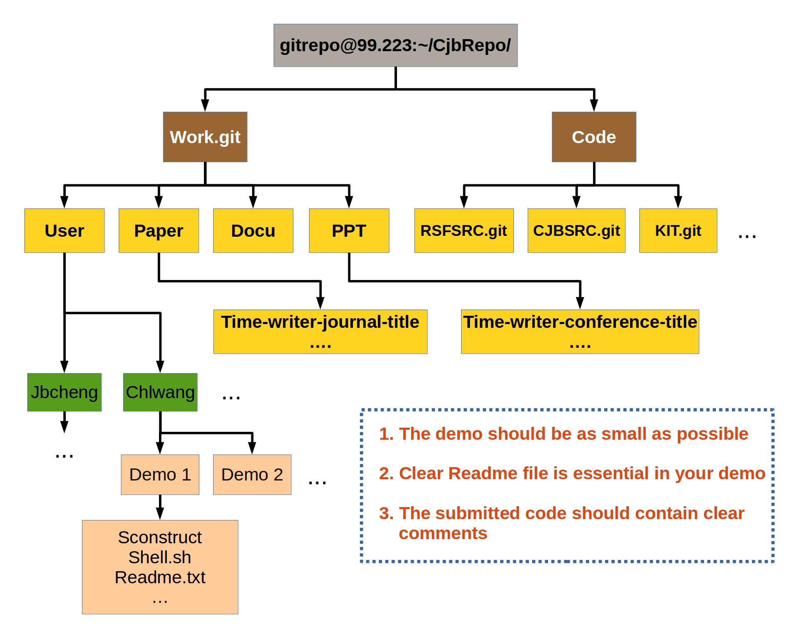

> Everyone you will ever meet knows something you don't --Bill Nye 

基于可共享可重复可修改的原则,
搭建了[程玖兵教授](http://mgg.tongji.edu.cn/space/cjb/)的内部程序管理版本库。该库基于目前最流行的版本控制软件(Git),
把小组的源代码,相应的demos,会议PPT以及可复制的发表论文托管在内部服务器上。目的在于能够有效合理的管理和继承共有的程序资源。

### 版本库结构
<figure>
	
</figure>

### 复制版本库

$ cd Your-local-repository-folder  
$ git clone gitrepo@99.223:~/CjbRepo/Work.git   
$ git clone gitrepo@99.223:~/CjbRepo/Code/RSFSRC.git   
$ git clone gitrepo@99.223:~/CjbRepo/Code/CJBSRC.git   
{: .notice}

如果需要学习基本的Git命令可以参见 “Git tutorial - the best version control software ”
